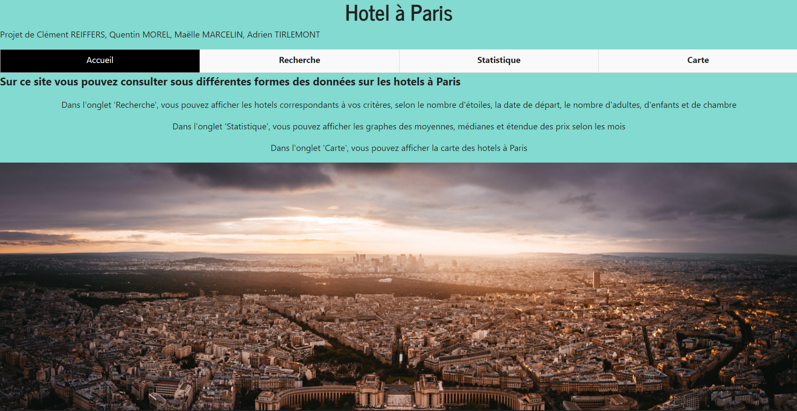
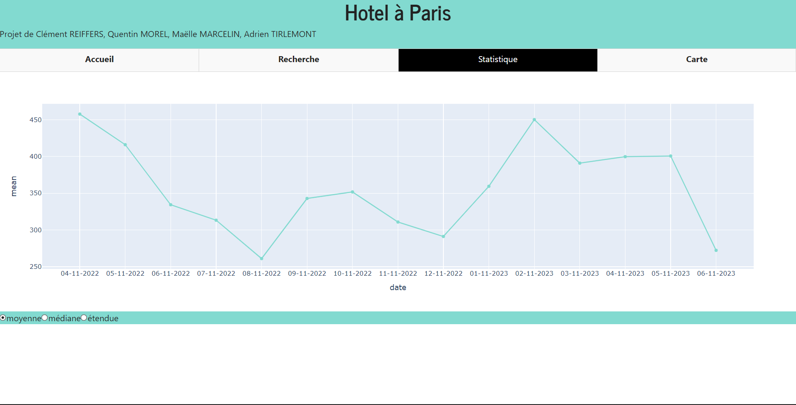

# HotelScraping

  

## Description

Scraping project made in python using selenium.  
Project main goal is to scrap datas from different website for study.
The python scripts create bots that navigates through the different hotels website (hotels.com, booking, trivago and kayak). It will use the research system and it will scrap all hotels' data on every available pages (the data gathered are stored into differente csv files, one csv file for each website).  
Those data can be used by the GUI app website to search for the hotel that best suit you or for analysis.
There is specific section on the gui app that allow you to study the price of the hotel and locate them on a map.

## Website scraped

- <hotels.com>
- <booking.com>
- <trivago.com>
- <kayak.fr>

## Hotels' data gathered

- Name
- Adress
- Price
- Number of stars
- Coordinates
- Number of persons (adults, children)
- Number of chambers

## GUI application

We implemented a GUI application made in dash and hosted on pythonanywhere : http://maaelle.pythonanywhere.com/ 

The website is in French. No english translation has been made.

### GUI source code

The code of the GUI available in this repository at https://github.com/clementreiffers/HotelScraping/tree/main/HotelScraping/website isn't our final GUI, it was only a test before coding it using Dash Python. 

So if you want to check the code of the GUI, you need to go there : 

https://github.com/maaelle/InterfaceHotel

### GUI description

On the website you can search an hotel by differents caracteristics. You can also summarize check the mean and variance price per month of all the hotels.  
Giving you informations about the most expensive month for sleeping at the hotels.

### GUI Images

| Main page | Research page |
| --- | --- |
|  |  |

| Statistics page | Map page |
| --- | --- |
|  |  |

## Other sources

The source code of the website can be found here :  
<https://github.com/maaelle/InterfaceHotel>

Flutter GUI prototype projetc :  
<https://github.com/clementreiffers/hotel-scraper-interface>

## Contributors

Maëlle Marcelin :  

- @maaelle
- <https://github.com/maaelle>

Clément Reiffers :

- @clementreiffers
- <https://github.com/clementreiffers>

Quentin Morel :

- @Im-Rises
- <https://github.com/Im-Rises>

Adrien TIRLEMONT :

- @Meatisdelicious
- <https://github.com/Meatisdelicious>

## APIs

Selenium :  
<https://www.selenium.dev>

Pythonanywhere :  
<http://maaelle.pythonanywhere.com>

Dash :  
<https://plotly.com/dash/>

